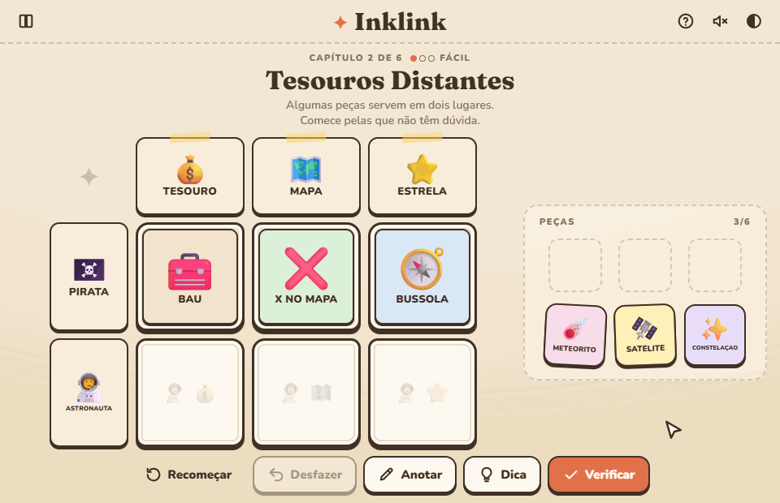
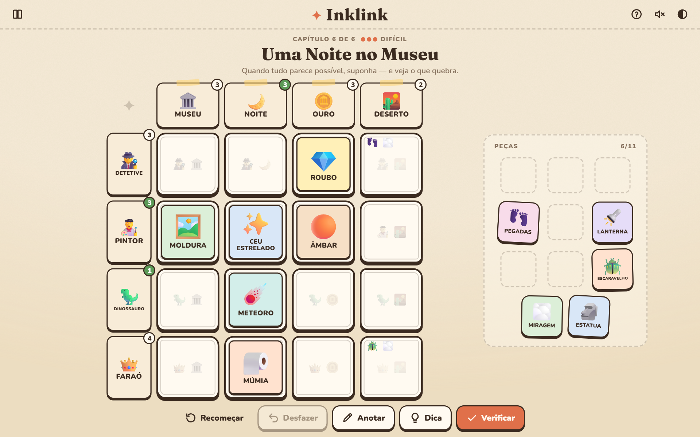
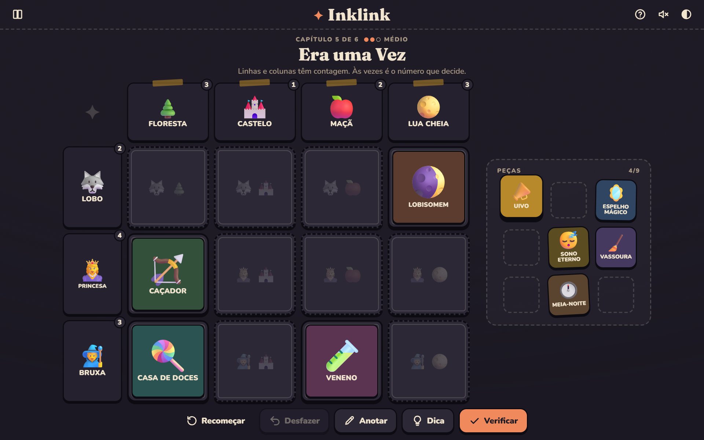
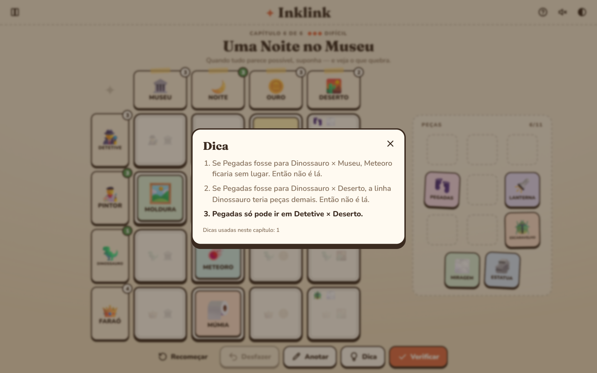
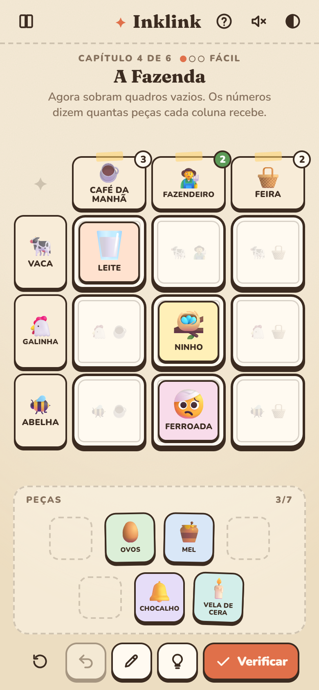

<div align="center">

# ✦ Inklink

**A cozy word-association logic puzzle.**<br>
Every clue links two words — find the one place where it truly belongs.

[](https://kyando.github.io/inklink/)




</div>

---

## The idea

Inklink turns the table-talk of association games like *Entre-linhas / Between the Lines* into a **solo deduction puzzle**.

Each panel on the board sits between a **row word** and a **column word**. Your job is to drop every clue piece into the panel where it fits *both*:

> 🩺 **Doctor** + 🐻 **Bear** → 🐾 **Veterinarian**

Easy — until a 🦛 **Hippo** column shows up and the veterinarian suddenly has two homes. Then the other pieces, and the numbers on the words, have to tell you which one is right. Early chapters are gentle association; later ones become proper *Sudoku / Einstein's riddle* style logic where you test a hypothesis and watch it break.

## Highlights

|  |  |
|---|---|
| 🧩 **Tactile play** | Drag & drop or tap-to-place, with pieces that fly, pop and swap into place |
| 🧠 **Real deduction** | Every level is machine-verified to have exactly **one** solution reachable by logic — no guessing |
| 💡 **Hints that teach** | Hints explain the *reasoning* ("if Footprints went here, Meteor would have nowhere to go…") instead of revealing answers |
| ✏️ **Pencil marks** | Note candidate pieces in panels, Sudoku-style |
| 📖 **Storybook look** | Paper textures, hand-drawn panels, light & dark themes, fully responsive |
| 🗂️ **Data-driven levels** | Levels are plain JSON, ready to also feed a printable puzzle-book edition |

## Screenshots

<table>
  <tr>
    <td colspan="2"></td>
  </tr>
  <tr>
    <td width="50%"></td>
    <td width="50%"></td>
  </tr>
</table>

<p align="center">
  
</p>

## How to play

1. Each panel sits between the word of its **row** and the word of its **column**.
2. Place every piece where it fits **both** words. A panel holds **at most one** piece.
3. Some pieces seem to fit in several places — use the other pieces to rule options out.
4. A **number** on a word tells how many pieces its row or column receives.
5. **Check** tells how many pieces are right (not which ones).

> The current levels are written in Brazilian Portuguese; the engine is language-agnostic.

## Under the hood

The game is split into a **pure logic core** and thin front-ends, so the same levels can power the web game, a printable book or a future engine port.

```
src/
  core/      pure TypeScript, no DOM
    puzzle.ts    level validation & bitmask indexing
    solver.ts    exhaustive search (solution counting / uniqueness)
    deduce.ts    human-style solver: named techniques → difficulty rating & hints
    explain.ts   natural-language explanation of each deduction
    analyze.ts   level analysis + solution explorer for authoring
  game/      session state, undo, persistence, hint selection
  levels/    *.json levels (ordered by file name)
  ui/        vanilla DOM + CSS (FLIP animations, pointer-based drag, synth SFX)
scripts/     authoring & tooling CLIs
tests/       Vitest suite — every shipped level is proven unique and solvable
```

### A design finding from the solver

Building the solver surfaced a neat constraint of the core mechanic:

- A **full board** (one piece per panel) always collapses to "this piece only fits here" steps — it can never require hypotheses.
- **Empty panels without extra info** make a level ambiguous whenever a piece could slide into an empty panel.
- **Row/column counts** are what create non-local deduction, and with it the "suppose… contradiction!" moments.

The deduction engine rates each level by the hardest technique it needs:

| Rating | Techniques |
|---|---|
| Easy | naked singles, full lines |
| Medium | hidden singles, lines that need exactly the remaining pieces |
| Hard | hypothesis → contradiction |

## Development

```bash
npm install
npm run dev              # play locally
npm test                 # validate every level + engine tests
npm run levels           # difficulty report (add -- --steps for the walkthrough)
npm run levels:explore -- src/levels/06-museu.json   # find unique solutions for a draft level
npm run media            # regenerate README screenshots & GIF (uses local Edge)
npm run deploy           # build and publish to GitHub Pages
```

### Level format

```jsonc
{
  "id": "farm",
  "title": "The Farm",
  "counts": "cols",                     // none | rows | cols | both
  "rows": [{ "id": "cow", "label": "Cow", "icon": "🐄" }],
  "cols": [{ "id": "breakfast", "label": "Breakfast", "icon": "☕" }],
  "clues": [
    // every panel where the clue is *plausible*, as "rowId+colId"
    { "id": "milk", "label": "Milk", "icon": "🥛", "candidates": ["cow+breakfast", "cow+market"] }
  ],
  "solution": { "milk": "cow+breakfast" }
}
```

`icon` accepts an emoji or an image path under `public/` (e.g. `assets/milk.svg`).

**Authoring flow:** write words and generous candidates → run `levels:explore` to get the solutions and count modes that make the level unique (hardest first) → paste `counts` + `solution` → `npm test`.

## Roadmap

- [ ] Printable puzzle-book (PDF) export from the same level files, with self-check codes
- [ ] In-browser level editor with live uniqueness & difficulty feedback
- [ ] Custom illustrated assets replacing emoji
- [ ] More chapters and an English level pack
- [ ] Playtest telemetry to calibrate ambiguous associations

## Credits

Designed and developed by **Bruno Ribeiro**. Inspired by the association board game *Entre-linhas*.
